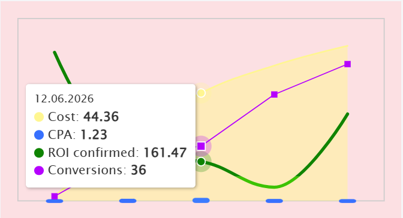

# ComboChart

Комбинированный график для временных рядов: **четыре последовательности данных на одном поле**, каждая своим типом отображения:

| # | Тип | Как выглядит |
|---|-----|--------------|
| 1 | `area`   | жёлтая сглаженная заливка |
| 2 | `bar`    | синие столбики со скруглением |
| 3 | `spline` | толстая зелёная кривая; ниже порога (по умолчанию 100) — светло-зелёная |
| 4 | `line`   | тонкая фиолетовая ломаная с квадратными маркерами |



- Чистый JS + SVG, **без зависимостей**, один файл `combo-chart.js` (~34 КБ без минификации).
- Общий тултип для всех рядов: дата, цветные точки, значения жирным; плавно «едет» за курсором, исчезает через 500 мс после ухода мыши.
- Ховер: полупрозрачные ореолы на точках всех рядов под курсором, ближайший столбик подсвечивается. Когда курсор ближе всего к зелёной кривой, она становится тонкой (как на записи), иначе — толстая.
- У каждого ряда своя шкала Y (кроме `bar`, который по умолчанию делит шкалу с `area`), осей и сетки нет — только рамка поля.
- Резиновый: перерисовывается при изменении размера контейнера.
- Появляется с анимацией слева направо (отключается, если в системе включено «уменьшить движение»).
- Мышь, тач (тап показывает тултип, тап мимо — скрывает) и клавиатура: `Tab` на график, `←` `→` по датам, `Home`/`End`, `Esc`. Есть `aria-label` для скринридеров.
- Типы для TypeScript: `combo-chart.d.ts`.

## Быстрый старт

Подробная пошаговая инструкция по запуску — в [RUN.md](RUN.md).

```bash
git clone https://github.com/GiorgiBarbariani/graph.git
cd graph
```

Откройте `index.html` в браузере (или `npm start` → http://localhost:8080) — там демо с данными с записи и пример на 30 дней.

## Инициализация с четырьмя последовательностями

1. Подключите скрипт и создайте контейнер:

```html
<div id="chart" style="width: 350px"></div>
<script src="combo-chart.js"></script>
```

2. Передайте четыре ряда — по одному на каждый тип:

```js
const chart = new ComboChart('#chart', {
  area: {
    name: 'Cost',
    data: [['2026-06-10', 2.04], ['2026-06-11', 25.85], ['2026-06-12', 44.36], ['2026-06-13', 55.65], ['2026-06-14', 63.75]]
  },
  bar: {
    name: 'CPA',
    data: [['2026-06-10', 0.68], ['2026-06-11', 0.86], ['2026-06-12', 1.23], ['2026-06-13', 0.79], ['2026-06-14', 0.71]]
  },
  spline: {
    name: 'ROI confirmed',
    data: [['2026-06-10', 610.78], ['2026-06-11', 180.5], ['2026-06-12', 161.47], ['2026-06-13', 56.33], ['2026-06-14', 357.25]]
  },
  line: {
    name: 'Conversions',
    data: [['2026-06-10', 3], ['2026-06-11', 30], ['2026-06-12', 36], ['2026-06-13', 70], ['2026-06-14', 90]]
  }
});
```

Высота: если у контейнера задана высота через CSS, график её заполняет; иначе — 175px (или опция `height`).

### Форматы точек

Любой из вариантов, можно смешивать:

```js
['2026-06-10', 2.04]                  // строка YYYY-MM-DD (локальная дата)
[1781049600000, 2.04]                 // timestamp в мс (UTC)
[new Date(2026, 5, 10), 2.04]         // Date
{ x: '2026-06-10T12:00:00', y: 2.04 } // объект: x | time | date | t  и  y | value | v
```

Ряды не обязаны иметь одинаковые даты: ось X — это объединение всех дат, отсутствующее значение (или `null`) даёт разрыв линии и не показывается в тултипе.

### Через массив `series`

Эквивалентная запись, удобна когда нужен свой порядок отрисовки или несколько рядов одного типа:

```js
new ComboChart('#chart', {
  series: [
    { type: 'area',   name: 'Cost',          data: cost },
    { type: 'bar',    name: 'CPA',           data: cpa },
    { type: 'spline', name: 'ROI confirmed', data: roi },
    { type: 'line',   name: 'Conversions',   data: conversions }
  ]
});
```

Ряды рисуются в порядке массива (следующий — поверх предыдущего).

### Модули / фреймворки

Файл в формате UMD: `<script>` → `window.ComboChart`, CommonJS → `const ComboChart = require('./combo-chart.js')`, в бандлерах (Vite/Webpack) → `import ComboChart from './combo-chart.js'`.

React-пример:

```jsx
function Chart({ cost, cpa, roi, conversions }) {
  const ref = useRef(null);
  useEffect(() => {
    const chart = new ComboChart(ref.current, {
      area: { name: 'Cost', data: cost },
      bar: { name: 'CPA', data: cpa },
      spline: { name: 'ROI confirmed', data: roi },
      line: { name: 'Conversions', data: conversions }
    });
    return () => chart.destroy();
  }, [cost, cpa, roi, conversions]);
  return <div ref={ref} style={{ width: 350 }} />;
}
```

## API

| Метод | Описание |
|-------|----------|
| `new ComboChart(target, options)` | `target` — CSS-селектор или DOM-элемент |
| `chart.setData(nameOrIndex, data)` | заменить данные одного ряда (по `name`, `type` или индексу) |
| `chart.setSeries(seriesArray)` | заменить все ряды |
| `chart.update(options)` | слить новые опции (и/или ряды) и перерисовать |
| `chart.render()` | принудительная перерисовка |
| `chart.destroy()` | удалить график и все обработчики |

## Опции

### Общие

| Опция | По умолчанию | Описание |
|-------|--------------|----------|
| `height` | `null` | высота в px; `null` — высота контейнера или 175 |
| `xSpacing` | `'category'` | `'category'` — равный шаг между датами (как на записи), `'time'` — пропорционально времени |
| `utc` | `false` | разбирать `YYYY-MM-DD` и форматировать даты в UTC |
| `fontFamily` | `"Lucida Grande", Verdana, "Lucida Sans Unicode", Arial, Helvetica, sans-serif` | шрифт тултипа |
| `animation` | `{ duration: 1000 }` | появление при первой отрисовке; `false` — без анимации |
| `ariaLabel` | `null` | подпись для скринридеров; по умолчанию собирается из названий рядов и дат |
| `plotBorderColor` / `plotBorderWidth` | `#cccccc` / `1` | рамка поля (`0` — без рамки) |
| `yAxes` | `{}` | ручные границы шкал: `{ 0: { min: 0, max: 100 } }` (ключ = `yAxis` ряда) |
| `tooltip.enabled` | `true` | |
| `tooltip.distance` | `16` | отступ тултипа от курсора |
| `tooltip.hideDelay` | `500` | задержка скрытия, мс |
| `tooltip.dateFormat` | `null` | `(date) => string`; по умолчанию `DD.MM.YYYY` (+ `HH:mm`, если в данных есть время) |
| `tooltip.formatter` | `null` | `({ date, time, index, points }) => html` — полностью своя разметка |

### Для каждого ряда

| Опция | Типы | По умолчанию | Описание |
|-------|------|--------------|----------|
| `name` | все | `Area` / `Bar` / `Spline` / `Line` | подпись в тултипе |
| `color` | все | `#FFF691` / `#3770FE` / `#0F8401` / `#B500FE` | |
| `yAxis` | все | `0` / `0` / `1` / `2` | ключ шкалы; ряды с одинаковым ключом делят шкалу |
| `decimals` | все | `0` для целых данных, иначе `2` | знаков после запятой в тултипе |
| `valuePrefix` / `valueSuffix` | все | `''` | например `'$'`, `'%'` |
| `valueFormatter` | все | — | `(value) => string` |
| `lineWidth` | area, spline, line | `1.5` / `3` / `1` | толщина линии |
| `hoverLineWidth` | area, spline, line | — / `1` / — | толщина, когда курсор ближе всего к этому ряду |
| `fillOpacity` | area | `0.5` | |
| `smooth` | area | `true` | сглаживать верхнюю границу |
| `threshold` / `negativeColor` | spline | `100` / `#3BC201` | значения ниже порога рисуются `negativeColor`; `negativeColor: null` — отключить |
| `markerSize` | line | `6` | размер квадратного маркера (`0` — без маркеров) |
| `widthRatio` / `maxWidth` | bar | `0.235` / `40` | ширина столбика как доля шага и максимум в px |
| `radius` / `overhang` | bar | `3` / `2` | скругление и выступ ниже нулевой линии |

Пример со своими настройками:

```js
new ComboChart('#chart', {
  height: 260,
  tooltip: { dateFormat: d => d.toLocaleDateString('ru-RU', { day: 'numeric', month: 'long' }) },
  area:   { name: 'Cost', data: cost, valuePrefix: '$' },
  bar:    { name: 'CPA', data: cpa, valuePrefix: '$', yAxis: 'cpa' }, // своя шкала — столбики станут выше
  spline: { name: 'ROI', data: roi, valueSuffix: '%', threshold: 0, negativeColor: '#e53935' },
  line:   { name: 'Conversions', data: conversions }
});
```

## Тесты

```bash
npm install
npm test
```

Нужен Node.js 22+. Используется встроенный `node:test` и `jsdom` (единственная dev-зависимость, в сам график не попадает). Тесты также гоняются в GitHub Actions на Node 22/24/26.

- `test/helpers.test.js` — чистые функции: разбор дат и точек, «красивые» шаги шкалы, форматирование дат, разбиение на сегменты по пропускам, сплайн (проходит через точки, без выбросов на экстремумах), позиционирование тултипа.
- `test/chart.test.js` — график в DOM: отрисовка всех четырёх типов, шкалы как на записи (75 / 750 / 120), общая шкала area+bar, объединение дат и разрывы, зоны сплайна, тултип и форматирование значений, ховер (ореолы, подсветка столбика, тонкая кривая), уход мыши и `hideDelay`, тач, клавиатура, `setData` / `update` / `destroy`, анимация, `aria-label`, экранирование HTML.

jsdom не считает раскладку, поэтому размеры в тестах — значения по умолчанию (350×175), а внешний вид (шрифты, цвета на экране) проверяется глазами через `index.html`.

## Лицензия

MIT
